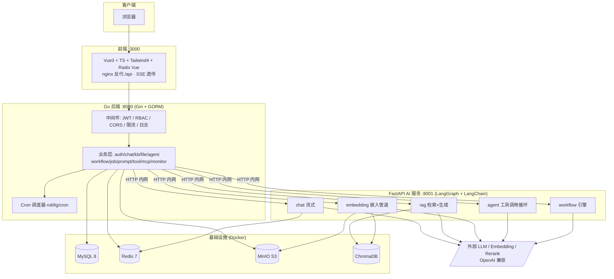
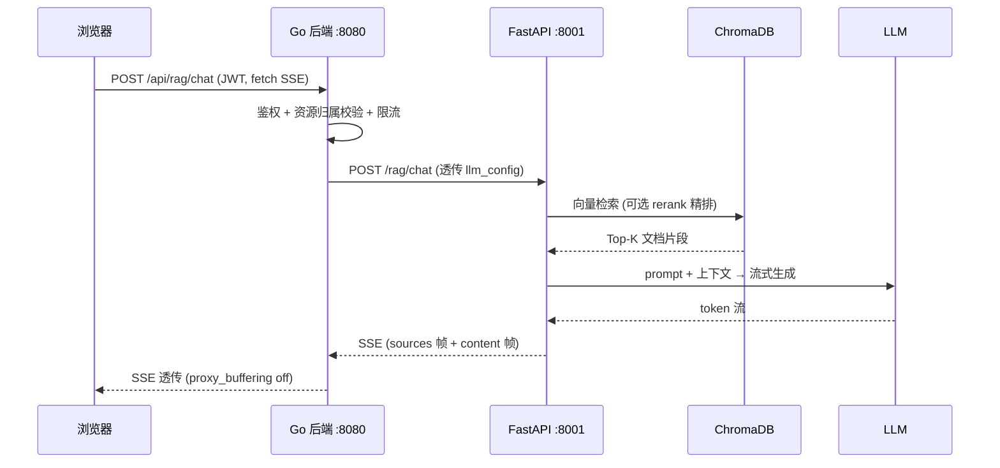
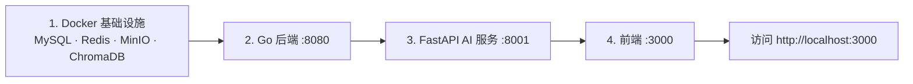
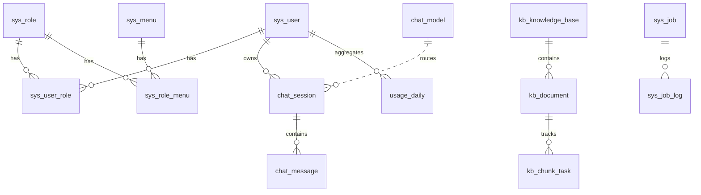
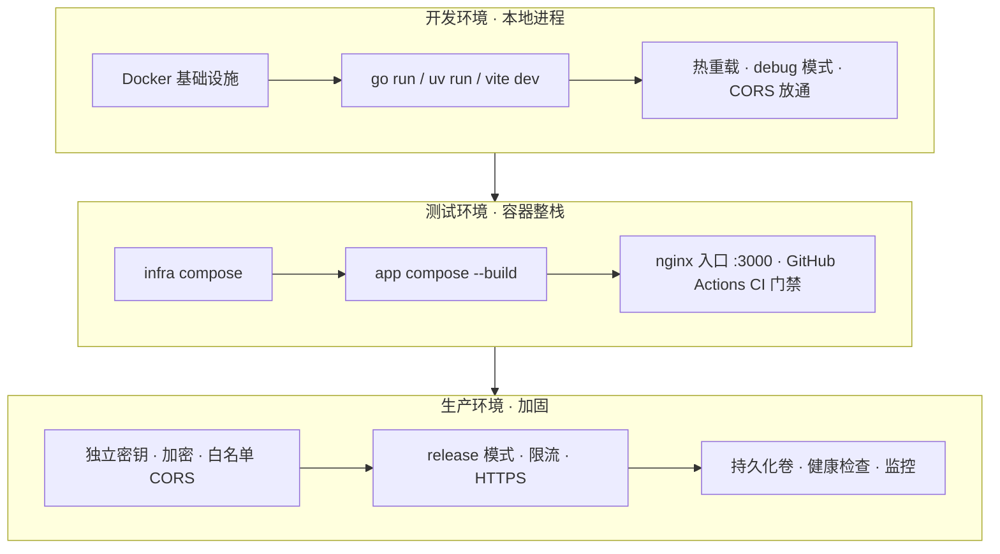

# AI Workspace

> 个人 AI 中枢平台 —— 集成 Chat、知识库、RAG、提示词中心、工作流、Agent、MCP、工具中心、文件中心与仪表盘，目标是以单一自托管平台替代 **ChatGPT + Dify + OpenWebUI + Notion AI** 的组合。

    

---

## 1. 项目介绍

**AI Workspace** 是一个面向个人/小团队的一体化 AI 工作平台。它将分散在多个 SaaS 工具中的 AI 能力收敛到一套自托管系统内，统一鉴权、统一数据归属、统一对接 LLM。

### 业务目标

| 目标 | 说明 |
|---|---|
| **统一 AI 入口** | 一个账号体系（RBAC）下完成对话、检索、内容生成、自动化等全部 AI 任务 |
| **私有知识库 + RAG** | 上传文档自动向量化，问答时检索增强，答案可溯源（来源引用） |
| **可编排自动化** | 通过 Agent（工具调用循环）、Workflow（LangGraph 画布）、Cron Job 实现任务自动化 |
| **可扩展工具生态** | 内置工具中心 + MCP（Model Context Protocol）服务器注册表，按需为 Agent 装配能力 |
| **数据自主可控** | 全部数据（MySQL/Redis/MinIO/ChromaDB）本地持久化，密钥加密落库，多用户资源严格隔离 |
| **多模型路由** | 任意 OpenAI 兼容提供商可即插即用；按会话/请求动态选择模型 |

### 核心模块

`Chat（SSE 流式）` · `知识库 & RAG` · `提示词中心` · `Agent` · `Workflow` · `MCP` · `工具中心` · `文件中心` · `定时任务` · `仪表盘 & 系统监控`

---

## 2. 技术架构

三层架构：**Vue3 前端 → Go/Gin 后端（REST + RBAC + 业务逻辑）→ FastAPI AI 服务（全部 LLM 交互）**。Go 层永不直接调用 LLM；FastAPI 永不直接读 MySQL。两者通过内网 HTTP 通信。

### 架构图



### 请求流转（以 RAG 问答为例）



---

## 3. 技术栈

| 层级 | 技术 |
|---|---|
| **前端** | Vue 3.5 · TypeScript 5.7 · Vite 6 · TailwindCSS 4（`@tailwindcss/vite` + typography）· Radix Vue（headless 组件）· lucide-vue-next（图标）· Pinia · Vue Router 4 · Vue Flow（工作流画布）· markdown-it + highlight.js + mermaid（解析下放 Web Worker）· DOMPurify · Vitest |
| **后端** | Go 1.23 · Gin · GORM（+ soft_delete 插件）· JWT · robfig/cron v3（动态调度）· zap + lumberjack（日志）· gopsutil（监控）· Viper（配置）· Swagger/swag |
| **AI 服务** | Python · FastAPI 0.115 · LangGraph · LangChain · OpenAI SDK · langchain-mcp-adapters（MCP 工具）· httpx · uv（依赖管理） |
| **数据库** | MySQL 8（19+ 张表，utf8mb4，软删除）|
| **缓存** | Redis 7（后端 DB 0 / AI 服务 DB 1，AOF 持久化）|
| **向量库** | ChromaDB（HTTP 客户端模式）|
| **对象存储** | MinIO（S3 兼容）|
| **可观测** | OpenTelemetry（Go `otelgin` + FastAPI 自动埋点，OTLP/HTTP 导出）· W3C traceparent 跨服务串联 · X-Request-ID 文本关联 |
| **DevOps** | Docker Compose（基础设施 + 应用双栈）· nginx（前端反代 + SSE 透传）· GitHub Actions CI |

---

## 4. 项目结构

```
AI Workspace/
├── ai-workspace-web/              # 前端（Vue3 + TS + Tailwind4 + Radix Vue）
│   └── src/
│       ├── api/                   # Axios HTTP 客户端模块（sse.ts 为共用 SSE 工具）
│       ├── views/                 # 页面组件（chat / knowledge / agent / workflow ...）
│       ├── components/ui/         # 统一组件库（AppButton/AppInput/AppDialog… 经 index.ts 出口）
│       ├── components/workflow/   # Vue Flow 工作流画布
│       ├── composables/           # 可复用组合式函数
│       ├── stores/                # Pinia 状态管理
│       ├── router/                # Vue Router + 路由守卫（按角色控制菜单）
│       ├── layout/                # 外壳 / 布局组件
│       └── types/                 # TypeScript 类型定义
│
├── ai-workspace-backend/          # Go 后端（Gin + GORM）
│   ├── cmd/server/                # 程序入口（main.go）
│   ├── internal/
│   │   ├── handler/               # Gin handler（各业务模块）
│   │   ├── service/               # 业务逻辑层（owned.go 统一资源归属过滤）
│   │   ├── repository/            # 数据访问层（DAO）：泛型 OwnedRepository[T] 封装 CRUD + 归属
│   │   ├── model/                 # GORM 模型（软删除 / Owned 接口）
│   │   ├── router/router.go       # 路由分层 public → auth → admin（含 otelgin 追踪中间件）
│   │   ├── middleware/            # JWT / CORS / 限流 / 日志 / Recovery / AdminRequired
│   │   ├── config/                # Viper 配置加载（config.Global）
│   │   ├── scheduler/             # 动态 cron 调度器
│   │   └── common/                # 标准响应包装 + 上传校验
│   ├── pkg/                       # 基础设施客户端：database/redis/minio/logger/fastapi/crypto/tracing
│   ├── config.yaml                # 本地开发配置
│   ├── config.docker.yaml         # 容器内配置（主机名为 compose 服务名）
│   └── Makefile                   # run / build / swag / tidy
│
├── ai-service/                    # FastAPI AI 服务（LangGraph + LangChain）
│   └── app/
│       ├── chat/                  # LLM 调用 + SSE 流式
│       ├── rag/                   # 向量检索 + rerank + 答案生成
│       ├── embedding/             # 文档切片 + 嵌入 + 写入 ChromaDB
│       ├── agent/                 # 工具调用 agent（HTTP 工具 + MCP 工具）
│       ├── workflow/              # LangGraph 工作流引擎（engine.py 拓扑执行）
│       ├── llm/provider.py        # LLM 提供方抽象（LRU 缓存多模型客户端）
│       ├── vectorstore/           # ChromaDB HTTP 客户端
│       ├── tracing.py             # OpenTelemetry 初始化（续接 Go 网关 traceparent）
│       └── config/settings.py     # Pydantic BaseSettings（从 .env 加载）
│
├── ai-workspace/sql/init.sql      # 全部表 DDL + 种子数据（MySQL 首次启动自动执行）
├── docker-compose.infra.yml       # 基础设施：MySQL / Redis / MinIO / ChromaDB
├── docker-compose.app.yml         # 应用：backend / ai-service / web（nginx）
└── .github/workflows/ci.yml       # CI：Go vet+test+build / 前端 tsc+vitest+build / AI 导入冒烟
```

---

## 5. 快速开始

### 5.1 环境安装

| 运行时 | 版本 | 用途 |
|---|---|---|
| **Go** | 1.23+ | 后端编译运行 |
| **Node.js** | 22+ | 前端构建（CI 锁定 Node 22）|
| **Python + uv** | uv 管理（astral-sh/uv）| AI 服务依赖与运行 |
| **Docker + Compose** | 最新 | 一键拉起全部基础设施 |
| **JDK** | 不需要 | ⚠️ 后端已由 Spring Boot 全面迁移至 Go，**无需 JDK**（历史 Sprint 1/10 遗留说明）|

> 说明：项目早期（Sprint 1）后端为 Spring Boot（需 JDK），自 Sprint 10 起已完整迁移到 Go。当前代码库**不含任何 Java 模块**，无需安装 JDK。

### 5.2 启动顺序（本地开发）

推荐启动顺序：**基础设施（MySQL/Redis/MinIO/ChromaDB） → Go 后端 → FastAPI AI 服务 → 前端**。



#### ① 基础设施（MySQL / Redis / MinIO / ChromaDB）

```bash
docker-compose -f docker-compose.infra.yml up -d
```

- MySQL 8（3306）：首次启动自动执行 `init.sql`，建表 + 种子数据（admin/123456）
- Redis 7（6379，AOF 持久化）
- MinIO（9000 S3 API / 9011 控制台，minioadmin/minioadmin）
- ChromaDB（8000）

#### ② Go 后端（:8080）

```bash
cd ai-workspace-backend
go mod tidy
make run            # = go run ./cmd/server -config config.yaml
# 其他：make build / make swag / go vet ./... / gofmt -l -w .
```

#### ③ FastAPI AI 服务（:8001）

```bash
cd ai-service
cp .env.example .env     # 填入 LLM_API_KEY 等（首次必做）
uv sync                  # 按 uv.lock 安装依赖
uv run python main.py    # uvicorn :8001，开发自动重载
```

#### ④ 前端（:3000）

```bash
cd ai-workspace-web
pnpm install             # 包管理器为 pnpm（corepack enable 可激活 packageManager 锁定版本）
pnpm dev                 # Vite :3000，代理 /api → localhost:8080
# 生产构建：pnpm build （先 vue-tsc 再 vite build）
```

打开 **http://localhost:3000**，使用 `admin / 123456` 登录（首次登录强制改密）。

### 5.3 一键容器化整栈（可选）

```bash
docker-compose -f docker-compose.infra.yml up -d
docker-compose -f docker-compose.app.yml up -d --build
# 入口 http://localhost:3000
```

> ⚠️ 应用容器与本机开发进程端口冲突（3000/8080/8001），二者择一运行。

---

## 6. 配置中心说明

### 6.1 后端 `config.yaml`（Viper 加载，全局 `config.Global`）

| 配置段 | 关键项 | 说明 |
|---|---|---|
| `server` | `port: 8080` · `mode: debug/release` | 服务端口与运行模式 |
| `database` | `dsn` · 连接池 | MySQL DSN（默认 `root/123456`），连接池上限 |
| `redis` | `addr` · `db: 0` | 后端用 Redis **DB 0** |
| `jwt` | `secret` · `expire: 86400` | JWT 密钥与有效期（24h）**生产务必更换** |
| `fastapi` | `base_url` · `timeout: 120` | FastAPI 内网地址与超时 |
| `minio` | `endpoint` · `access/secret_key` · `bucket` | 对象存储连接 |
| `ratelimit` | `llm_per_minute: 20` · `llm_per_minute_admin: 60` | LLM 端点分级限流（每用户每分钟，≤0 关闭）|
| `upload` | `max_size_mb: 50` · `file_exts` · `doc_exts` | 上传大小上限与扩展名白名单 |
| `security` | `secret_key` | 敏感字段（api_key）AES-256-GCM 加密密钥，留空回退 `jwt.secret` |
| `cors` | `allowed_origins` | 留空/含 `*` 放通；多用户部署填显式白名单 |
| `tracing` | `service_name` · `endpoint` | OpenTelemetry OTLP/HTTP 端点（如 `localhost:4318`），留空则不启用追踪 |
| `log` | `level` · `filename` · 轮转 | zap + lumberjack 日志轮转 |

> 容器内使用 `config.docker.yaml`（主机名替换为 compose 服务名 mysql/redis/minio）。

### 6.2 AI 服务 `.env`（Pydantic BaseSettings）

| 分组 | 变量 | 说明 |
|---|---|---|
| **Chat LLM** | `LLM_API_KEY` · `LLM_API_BASE` · `LLM_MODEL` · `LLM_TIMEOUT` · `LLM_MAX_RETRIES` | 任意 OpenAI 兼容接口（示例 DeepSeek）|
| **Embedding** | `EMBEDDING_API_KEY` · `EMBEDDING_API_BASE` · `EMBEDDING_MODEL` | 独立嵌入提供商（DeepSeek 无嵌入端点，推荐硅基流动 `BAAI/bge-m3`）；留空回退 `LLM_*` |
| **Rerank** | `RERANK_ENABLED` · `RERANK_MODEL` · `RERANK_RECALL_K` | 召回后精排（P2-3）；关闭时退化纯向量检索 |
| **Redis** | `REDIS_HOST/PORT/DB=1` | AI 服务用 **DB 1**（与后端 DB 0 隔离）|
| **ChromaDB** | `CHROMA_HOST/PORT` · `CHROMA_COLLECTION_PREFIX` | 向量库地址与集合前缀（多租户隔离）|
| **MinIO** | `MINIO_ENDPOINT` · `ACCESS/SECRET_KEY` · `BUCKET` | 嵌入管道下载文档 |
| **App** | `APP_HOST/PORT/DEBUG` · `CORS_ORIGINS` | 服务自身配置，生产 `APP_DEBUG=false` |
| **Tracing** | `TRACING_ENDPOINT` · `TRACING_SERVICE_NAME` | OpenTelemetry OTLP/HTTP 端点（如 `http://localhost:4318`），留空则不启用；续接 Go 网关同一条 trace |

> ⚠️ 切换嵌入模型后**必须重建知识库索引**（旧向量与新模型不兼容）。

### 6.3 Docker Compose

| 文件 | 职责 |
|---|---|
| `docker-compose.infra.yml` | MySQL/Redis/MinIO/ChromaDB；命名网络 `ai-workspace-net`；数据持久化到命名卷；`init.sql` 只读挂载 |
| `docker-compose.app.yml` | backend/ai-service/web；以 `external` 方式加入同一网络；LLM 密钥从宿主环境透传；nginx 反代 `/api` 并开启 SSE 透传 |

---

## 7. API 文档

所有端点以 `/api/` 为前缀，标准响应包装 `{ code, message, data }`（`internal/common/result.go`）。

### Swagger / OpenAPI

后端集成 **swag** 注解生成 OpenAPI 文档：

```bash
cd ai-workspace-backend
make swag        # = swag init -g cmd/server/main.go -o docs（生成 docs/ 下 OpenAPI spec）
```

### 主要端点一览

| 模块 | 端点 | 备注 |
|---|---|---|
| **Auth** | `POST /api/auth/login` · `/logout` · `GET /api/auth/info` | 返回 roles / mustChangePwd |
| **用户管理** | `/api/user/`（page/add/update/delete/status）| 仅管理员，bcrypt 密码 |
| **Chat** | `POST /api/chat/send`（SSE）· `/api/chat/session/`（CRUD）| 滚动摘要降 token |
| **KB/RAG** | `/api/kb/` · `/api/document/` · `POST /api/rag/chat`（SSE）· `/api/rag/rebuild` | 答案带来源引用帧 |
| **Files** | `/api/file/`（MinIO，presign 1h）| 大小/扩展名/真实 MIME 校验 |
| **Agent** | `/api/agent/` + `POST /api/agent/{id}/run` | 用户私有 · HTTP/MCP 工具循环 |
| **Workflow** | `/api/workflow/` + `POST /api/workflow/{id}/run` | LangGraph 画布定义 |
| **Job** | `/api/job/`（+ run/log/clean）| 仅管理员，cron 调度 |
| **Prompt / Tool / MCP** | `/api/prompt/` · `/api/tool/` · `/api/mcp/`（+ `test/{id}`）| 用户私有 |
| **Monitor/Dashboard** | `GET /api/dashboard/stats` · `/api/monitor/server` · `/health` | server/health 仅管理员 |

### FastAPI 内部接口（仅后端调用，不对外暴露）

`POST /chat` · `POST /rag/chat` · `POST /embedding/build` · `DELETE /embedding/delete` · `POST /agent/run` · `POST /workflow/run` · `GET /health`（`http://localhost:8001`）

### SSE 流式约定

Chat/RAG 用原生 `fetch()`（Axios 不支持 SSE），前端统一走 `api/sse.ts:streamSSE`：处理鉴权头、UTF-8 增量解码、`data: <json>` 解析、`data: [DONE]` 哨兵、`AbortSignal` 取消。Go handler 将 FastAPI 的 SSE 透传到浏览器。

---

## 8. 数据库设计

MySQL 8，**19+ 张表**，统一约定：`BIGINT AUTO_INCREMENT` 主键、`deleted BIGINT` 软删除（GORM soft_delete milli 模式：0=未删，非 0=删除毫秒时间戳）、`utf8mb4`、时间戳由 GORM 自动填充。DDL 与种子数据全部在 `ai-workspace/sql/init.sql`。

### 表结构关系



### 表清单

| 分类 | 表 | 职责 / 归属列 |
|---|---|---|
| **RBAC** | `sys_user` · `sys_role` · `sys_user_role` · `sys_menu` · `sys_role_menu` | 用户/角色/菜单权限；`role_code` 带 `ROLE_` 前缀；`must_change_pwd` 强制改密；`api_key` 加密存储 |
| **Chat** | `chat_session` · `chat_message` · `chat_model` | 会话/消息（`user_id`）；`summary`+`summary_upto_id` 滚动摘要；`chat_model` 多模型路由（Go 管理）|
| **知识库** | `kb_knowledge_base` · `kb_document` · `kb_chunk_task` | RAG 管道（`create_by`）；`status` PENDING→PROCESSING→DONE/FAILED；`task_status` PENDING/RUNNING/SUCCESS/FAILED；嵌入分批防 OOM + `embeddingReconcileJob` 对账自愈卡死文档 |
| **文件** | `file_info` | 文件中心，归属列 `upload_by` |
| **Agent/Workflow** | `agent` · `workflow` | `tools`/`definition` 为 JSON 字符串（`create_by`）|
| **自动化** | `sys_job` · `sys_job_log` | cron 任务（`status` 0=运行/1=暂停）；日志**物理删除**、仅 `create_time`、无 `deleted` 列 |
| **能力扩展** | `prompt` · `tool` · `mcp_server` | 提示词/工具/MCP 注册表（`create_by`）；`mcp_server.transport` sse/stdio |
| **统计** | `usage_daily` | 按用户按日用量聚合 |

### 资源归属（强约束）

用户私有资源严格隔离，归属语义统一收口在 `internal/repository`（泛型 `OwnedRepository[T]`：`FindOwned` 单条 404/403 三态、`OwnedScope[T]` 列表过滤）；`internal/service/owned.go` 委托到 repository 作为单一真相来源。**禁止手写 `Where("create_by = ?")` 字面量**（曾因此出现 IDOR）。归属列：KB/Agent/Workflow/Prompt/Tool/MCP=`create_by`，Chat=`user_id`，文件=`upload_by`。

> 维护约定：任何表结构变更必须同步更新 `init.sql`。

---

## 9. 部署指南

### 环境矩阵



### 9.1 开发环境

- 基础设施用 Docker，三个应用以本地进程运行（`make run` / `uv run python main.py` / `pnpm dev`）。
- `server.mode=debug`、`APP_DEBUG=true`，热重载开启，CORS 放通便于联调。

### 9.2 测试环境

- 容器化整栈：先 `infra` 后 `app --build`，统一从 nginx 入口 `:3000` 访问。
- **CI 门禁**（`.github/workflows/ci.yml`，push/PR 到 master/main 触发）：
  - **Go**：`gofmt` 检查 → `go vet` → `go test` → `go build`
  - **前端**：`pnpm install --frozen-lockfile` → `vue-tsc --noEmit` → `vitest run` → `vite build`
  - **AI 服务**：`uv sync --frozen` → 导入冒烟（路由装配 + 配置加载）

### 9.3 生产环境（加固清单）

| 项 | 要求 |
|---|---|
| **密钥** | 更换 `jwt.secret`；单独配置 `security.secret_key`（勿回退 jwt）；轮换 MySQL/MinIO 默认口令 |
| **运行模式** | 后端 `server.mode=release`；AI 服务 `APP_DEBUG=false` |
| **网络** | `cors.allowed_origins` 与 `CORS_ORIGINS` 改为显式白名单；前端经 HTTPS（在 nginx 前置 TLS）|
| **限流** | 按需调整 `ratelimit.llm_per_minute(_admin)` |
| **强制改密** | 默认 admin 首登强制改密（`must_change_pwd`），勿保留默认口令 |
| **持久化** | MySQL/Redis(AOF)/MinIO/ChromaDB 均挂命名卷；定期备份 |
| **可观测** | `GET /health`（后端/AI）做容器健康检查；`/api/monitor/*` 看服务器与依赖健康；配置 `tracing.endpoint`/`TRACING_ENDPOINT` 接入 OTLP 后端（Jaeger/Tempo/Collector）串联全链路 |
| **SSE** | nginx `proxy_buffering off` 保证流式不被缓冲 |

---

## 附录：开发规范要点

- **前端**：禁用 Element Plus / `<style scoped>` / `::v-deep` / `!important`；样式一律 Tailwind utility；统一组件从 `components/ui/index.ts` 出口引入。
- **后端**：归属过滤必走 `owned.go` / `repository.OwnedRepository`，禁止字面量 `Where`；表结构变更同步 `init.sql`。
- **AI 服务**：依赖用 `uv add`；嵌入临时文件已用 `tempfile.gettempdir()`（跨平台），按 `EMBED_BATCH_SIZE` 分批嵌入防 OOM。
- **分层铁律**：Go 不直接调 LLM，FastAPI 不直接读 MySQL；`llm_config` 仅服务间内网流转，不对客户端暴露。
