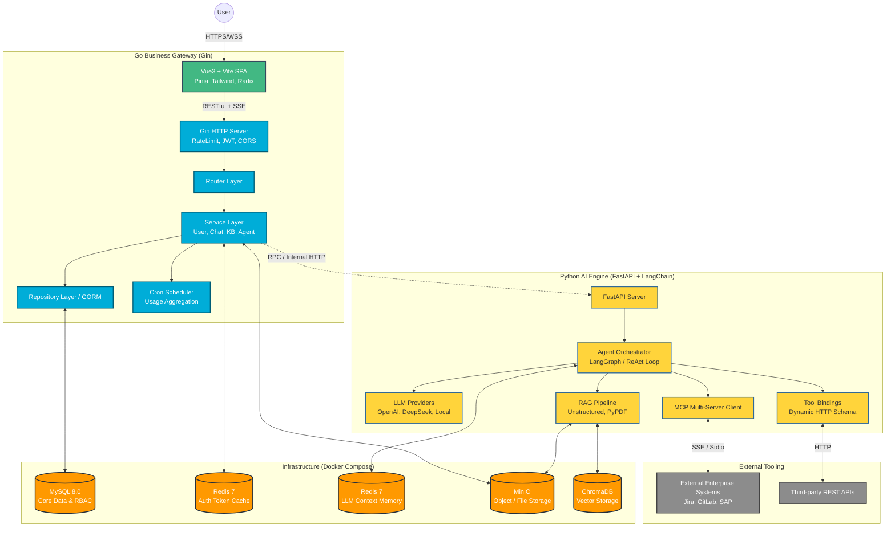

# AI Workspace 项目架构审计报告

作为拥有 15 年经验的 Staff Engineer / AI Platform Architect，在对本项目前端 (Vue3)、后端 (Gin)、AI 服务 (Python) 以及基础设施层面进行了全面深度的代码与结构审计后，输出此架构评估报告。

## 1. 综合架构评分：8.2 / 10 (优秀，具备企业级基础)

项目采用了非常经典且务实的**三层架构** (Web 前端 -> Go 业务网关 -> Python AI 引擎)。基础设施选型（MySQL + Redis + MinIO + Chroma）非常完善，能够良好支撑中等规模的生产级 AI 平台应用。

---

## 2. 架构优点 (Pros)

1. **极致的 AI 安全设计**：Python 层内置了防御 Prompt Injection 的机制，对工具调用的输出实施了严格的 `sanitize_tool_output` 和数据栅栏 `fence`，防止了二次注入。
2. **前沿的协议支持 (MCP)**：在 `agent/service.py` 中原生集成了 `langchain-mcp-adapters`，使得系统在早期就具备了接入外部 Model Context Protocol 服务器的能力，远见卓识。
3. **基础设施健壮**：Go 后端提供了完备的中间件（`ratelimit` 限流、`jwt` 鉴权、`cors`、`recovery`），并在 MySQL 中对核心实体使用 `soft_delete milli`（毫秒级软删），保障了数据一致性。
4. **前端状态治理清晰**：Pinia `chat.ts` 严格剥离了「数据状态」与「UI/交互状态」（如流式接收管道、AbortController 等），避免了常见的内存泄漏和悬挂引用。
5. **异步 Token 统计机制**：通过 `sys_job` 每日凌晨离线跑批汇算 `usage_daily`，将高频写压力从业务主流程中解耦。

---

## 3. 架构缺陷 (Cons)

1. **Go 后端分层不彻底**：缺乏独立的 `Repository` (DAO) 层。GORM 数据库操作与业务逻辑强耦合在 `internal/service` 中，这导致业务代码难以编写无外部依赖的单元测试。
2. **缺乏依赖注入 (DI) 框架**：Go 端存在 `deps.go`，但似乎是手动组装依赖。随着系统组件增多，缺乏 `google/wire` 或 `uber-go/dig` 会导致初始化逻辑臃肿。
3. **全链路可观测性缺失**：虽然拥有日志记录（Zap/Lumberjack），但在 Go 与 Python 服务之间缺乏分布式链路追踪（Distributed Tracing，如 OpenTelemetry/Jaeger）。当发生 SSE 断流或响应缓慢时，难以快速定界是网关慢还是大模型慢。

---

## 4. 性能瓶颈 (Bottlenecks)

1. **前端 Markdown 渲染卡顿 (Main Thread Blocking)**：前端强依赖 `markdown-it`、`highlight.js` 和 `mermaid`。在高速 SSE 流式输出包含大量代码块的消息时，同步的语法高亮计算会阻塞主线程，导致页面滚动掉帧（Stuttering）。
2. **聊天记录表无分区/分库**：`chat_message` 表的 `content` 为 `longtext`。随着对话增多，该表体积将急剧膨胀，且缺乏针对用户的 Sharding 或按月 Partition 机制，未来在历史会话检索和分页加载时会产生严重 IO 瓶颈。
3. **向量检索与业务库无同步对齐**：ChromaDB 与 MySQL 中 `kb_document` 状态如若发生不一致（例如进程被杀），缺乏对账与自愈机制。

---

## 5. 未来风险 (Risks)

1. **Python AI 服务的并发瓶颈**：当前 LangChain 的 `bind_tools` 和 `MAX_ITERATIONS` 在 `asyncio` 下运行。如果发生大量并发的 RAG PDF 解析或长期持有的 Agent 循环，由于 Python GIL 的限制以及大量 CPU 密集型任务（如文档切片），可能会导致 FastAPI 的 Event Loop 阻塞。
2. **大文件内存溢出**：若前端上传超大文档至 MinIO 后，Python 读取执行 Chunking（分块）时未流式处理，极易导致 OOM。
3. **单点故障 (SPOF)**：虽然 Docker Compose 配置了 `restart: unless-stopped`，但目前架构是单体运行，Redis 和 MySQL 没有配置主从高可用。

---

## 6. 演进与优化路线图 (Roadmap)

### 【P0】核心修复与基础设施 (0-1 个月)
* **前端渲染优化**：将 `highlight.js` 和 `markdown-it` 放到 Web Worker 中进行解析，彻底解决流式渲染的卡顿问题。
* **架构重构**：在 Go 后端引入 Repository 模式，剥离 Service 中的 GORM 代码；引入 `google/wire`。
* **Agent / MCP 闭环**：完善 Agent Center 和 MCP 接入的前端 UI，因为底层 DB 表和 Python 侧的核心调度代码已经就绪（**商业价值极高**，实现难度 Low）。

### 【P1】高价值 AI 能力补齐 (1-3 个月)
* **Prompt Center**：实现系统提示词的集中管控与版本追踪（难度 Low）。
* **RAG 管道健壮化**：补齐文档切片状态流转（使用已有的 `kb_chunk_task` 表），支持从 MinIO 拉取并持久化至 Chroma，并提供检索召回率的测试接口。
* **分布式链路追踪**：引入 OpenTelemetry，串联 Frontend -> Gin -> FastAPI 链路，便于排障。

### 【P2】高级 AI 交互与编排 (3-6 个月)
* **Workflow (工作流引擎)**：对接前端已经存在的 `@vue-flow` 依赖，利用 Python 端的 `langgraph` 实现节点拖拽编排的可视化 Agent 工作流（商业价值 Very High，实现难度 High）。
* **Artifact (智能产物面板)**：实现类似 Claude 的 Artifact 能力，分离对话流与独立应用/代码/卡片的渲染状态。

### 【P3】高可用与多模型 (6 个月+)
* **多模型路由分发 (Multi Model)**：实现模型自动降级（Fallback）与意图路由，如复杂任务走 GPT-4o/DeepSeek V3，简单分发走本地 Ollama。
* **数据库分表/归档**：对 `chat_message` 实施冷热分离，超过 3 个月的历史记录自动归档或迁移到 Elasticsearch 中以支持全文检索。

---

## 7. 推荐最终架构图 (Mermaid)

